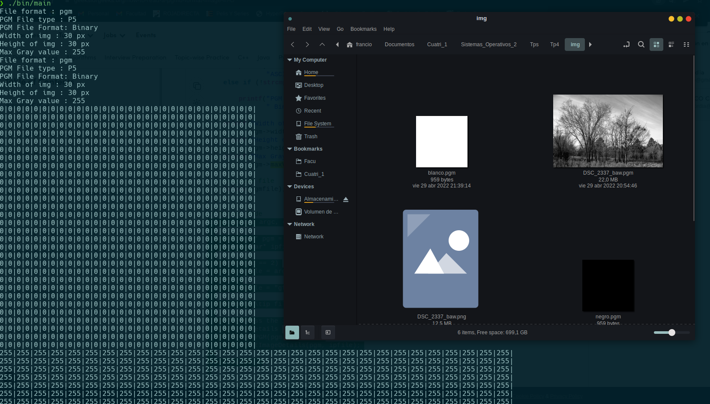
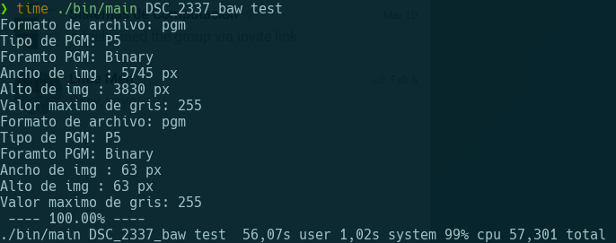
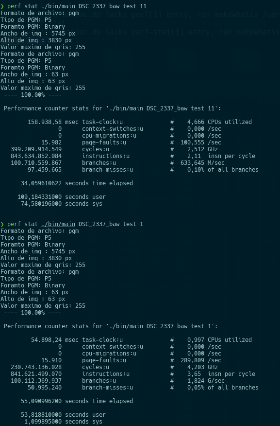
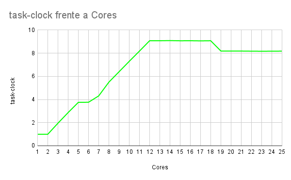
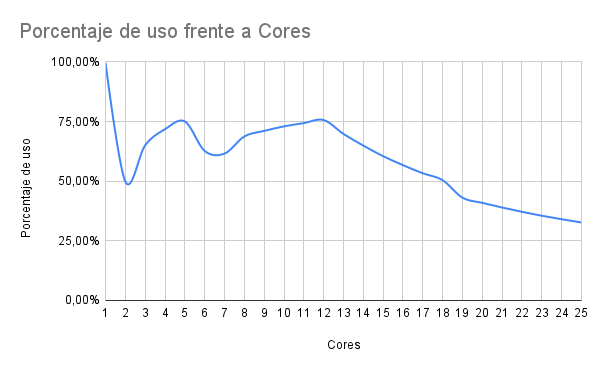
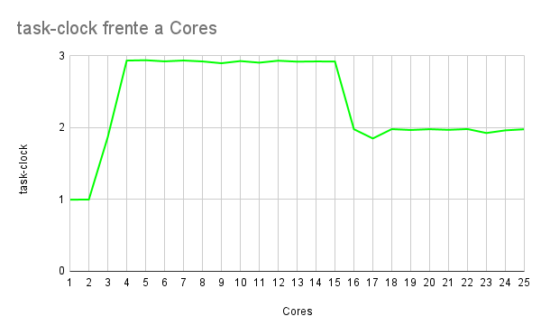
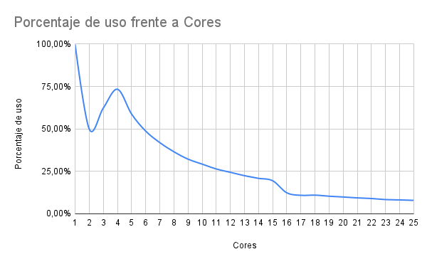

# Sistemas operativos 2-Trabajo practico 4
## Informe
### Descripcion
El programa consiste en reconocer un patron en una imagen, es decir, tenemos 2 imagenes que una es recorte de la otra. Con las operaciones propuestas con por los profes, pasamos las imagenes a un formato amigable, los investigados fueron .png que era el formato original, .bmp que por cuestiones de de formato no logre obtener la matriz monocromatica. Finalmente encontre un codigo que me guio con el formato .pmg. De esta forma obtuve la matriz monocromatica y las dimensiones de las imagenes.
Aca una prueba de 2 imagenes en negro y blanco viendo que se obtienen los valores:

Con 4 for hago las operaciones y guardo todo en una matriz mas, que mediante una ponderacion los valores los paso a escalas de grises y me genero otra imagen .pgm que es el mapa de distancias, ademas agregue que se genere otra imagen igual a la base con el recorte marcado.

La primera ejecucion sin paralelismo fue esta:

Despues de esto se agregaron los pragmas, a cada for se le puso su correspondiente paralelismo, en el caso de los escritores y lectores de las imagenes se les puso el parametro ordered ya que sino las imagenes se dibujaban mal. Para la barra de progreso tambien se coloco, pero esta termino secuencializando las ejecuciones. Por otro lado el Scheduler dinamico termino teniendo los mejores resultados. La primera comparativa fue:

En la imagen se que el tiempo se reduce a la mitad, pero que casi no se aprovechan los cores, entonces me quede probandopara mejorar esto con distintas configuraciones. Las herramientas de collapse y reduction no resultaron mejorar en mayoria los tiempos. Finalmente, el problema resulto ser la barra de progreso (Para la sorpresa de nadie). Una vez visto las ejecuciones, se lograron tiempos de 8 segundos y aprovechar el 10 cpus de 12 (No me enorgullece pero es lo que se logro). Aca podemos ver una comparativa hecha en una cpu de 12 nucleos:

_frente_a_Core_mainPCs.png)

Con una pc de 4 nucleos:

_frente_a_Cores_not.png)
 
Me parecieron muy interesantes los resultados obtenidos, sobretodo el porcentaje de uso del cpu en los 12 nucleos de como el aprovechamiento sube, baja y vuelve a subir. Y a medida que aumentas la cantidad de nucleos virtualizados, el rendimiento empeora o se estanca.

## Herramientas de profiling
### Cachegrid con callgrid
Es un cache profiler, que provee una simulacion detallada de la cache en el cpu, sirve para idenficiar los *cache missed* y contarlos, tambien ver las referencias a memoria y instrucciones ejecutando linea a linea. Callgrid es una extension que ademas provee *callgraphs*, y una GUI para visualizar mejor la salida de Cachegrid.

### AppDynamics
Este software de ciscoes un gestor de performance y analizador de operaciones, se enfocan en el manejo de performance en entornos de la nube y arquitecturas en red.

### CodeXl (AMD)
Una profiler con una GUI muy comoda que usa el profiling especifico del hardware ya que este esta diseñado y funciona en procesadores AMD, pero ademas posee tecnicas de lo profiling que se pueden utilizar enprocesadores no necesariamente AMD. En Abril de 2020 este dejo de tener soporte de parte de AMD por lo cual su repositorio esta archivado.

### perf-stat
Agrego a los anteriores ya que es la usada en el trabajo
